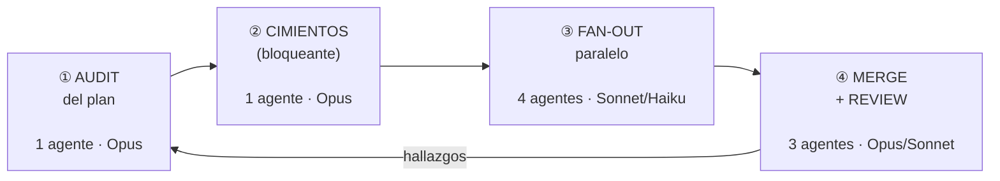

# Workflow de agentes en paralelo

Cómo se desarrolla este proyecto usando varios agentes de Claude Code a la vez.

La idea central: **el paralelismo sólo rinde si cada agente es dueño exclusivo de un
set de archivos disjunto.** Si dos agentes editan `layout.tsx`, el tiempo que ganás
en paralelo lo perdés resolviendo conflictos. Todo lo que sigue es consecuencia de
esa regla.

## El loop

Una iteración = una tanda de features.



### ① Audit del plan

Antes de escribir código se audita el plan. Ejes fijos: modelo de datos, RLS,
viabilidad del free tier, flujo de foto en iOS, y secuenciación en lanes.
Ver [la skill `/plan-audit`](#la-skill-plan-audit) más abajo.

### ② Cimientos — no paralelizable

Todo el resto importa de acá, así que va solo y primero:

```
supabase/migrations/0001_init.sql   ← schema + policies RLS
src/lib/supabase/{client,server}.ts ← clientes browser / server
src/lib/types.ts                    ← tipos de las filas
```

Hasta que esto no esté fijo, las lanes de ③ no tienen contrato contra el cual
trabajar.

### ③ Fan-out — lanes con propiedad disjunta

| Lane | Dueño exclusivo de | Modelo |
|---|---|---|
| **L1 · Auth** | `src/app/(auth)/**`, `src/middleware.ts` | Sonnet 5 |
| **L2 · Plan** | `src/app/plan/**`, `src/app/actions/plans.ts` | Sonnet 5 |
| **L3 · Log + Foto** | `src/app/log/**`, `src/app/actions/logs.ts`, `src/lib/storage.ts` | Sonnet 5 |
| **L4 · Shell + PWA** | `src/app/manifest.ts`, `src/app/layout.tsx`, `public/icons/`, `src/components/nav*` | Haiku 4.5 |

Para aislamiento fuerte, los agentes pueden lanzarse con `isolation: "worktree"`,
que le da a cada uno su propio worktree de git. Conviene cuando dos lanes
empiezan a rozarse.

### Integración — después del fan-out, en serie

`src/app/dashboard/**` y `src/app/recipes/**` dependen de L2 y L3, y es donde se
decide la lógica de "cumplí o no cumplí" el plan del día. Va **solo, con Opus**.

### ④ Merge + review

Tres agentes en paralelo, todos de sólo lectura:

- **`/security-review`** — obligatoria. Las Server Actions de Next son endpoints
  POST públicos, y las tablas hijas (`plan_days`, `planned_meals`) no tienen
  `user_id` directo, así que sus policies RLS dependen de joins.
- **`/code-review`** — revisión general del diff.
- **Verificación** — `npm run lint` y `npm run build`.

Los hallazgos vuelven a ①.

## Qué modelo para qué fase

| Fase | Modelo | Por qué |
|---|---|---|
| Audit del plan · schema + RLS · integración del dashboard | **Opus 5** | Decisiones irreversibles: un error en el modelo de datos o en RLS se paga en cada iteración posterior |
| Features de las lanes (CRUD, formularios, rutas) | **Sonnet 5** | Trabajo bien especificado, con el contrato ya fijado por los cimientos |
| Iconos, boilerplate, arreglos de lint | **Haiku 4.5** | Mecánico, sin decisiones de diseño |
| Security review | **Opus 5** | Es el punto más riesgoso del proyecto |
| Code review general, build y lint | **Sonnet 5** | Suficiente, y más barato |

## La skill `/plan-audit`

No existe una skill nativa que audite planes. Este repo define la suya para que el
paso ① sea repetible y no dependa de redactar bien el prompt cada vez.

Piezas relacionadas que ya vienen con Claude Code:

- **Agente `Plan`** — arquitecto built-in, la pieza correcta para el eje
  "arquitectura y planificación".
- **`/security-review`** y **`/code-review`** — para la fase ④.
- **`/loop`** — corre un prompt o slash command en intervalos, para automatizar la
  vuelta del loop.
